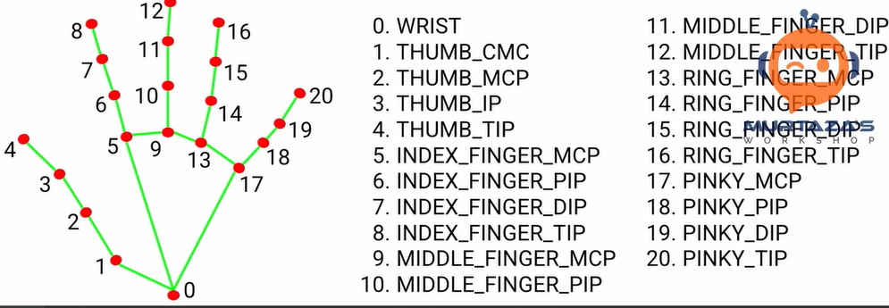
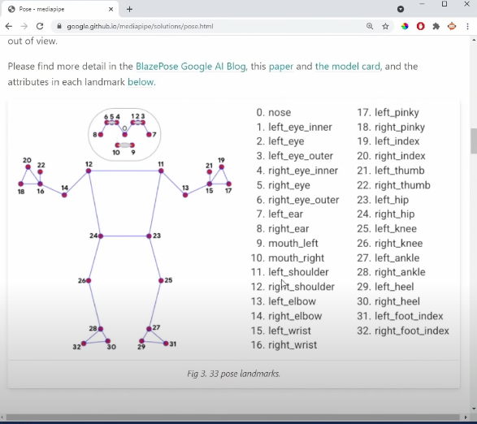

<h1>Computer Vision Recognition LVL 1</h1>
<h2>

> Status: Developing ⚠️

</h2>

<h2>Project Steps</h2>

<h3>

 1. 📁  Develop .py modules :
</h3>

<h4>

> * 📝 ✔️ Detection and Tracking Hands 
>
> * 📝 ✔️   Face Detection   
>
> * 📝 🚧 (DEV) Face Mesh  
>
> * 📝 ✔️ Pose  
>
> * ⚠️ Possible Creation of New Modules(DEVELOPING) 
</h4>

<h3>
2. 📁 Develop code that read gestures ⚠️(NEXT STEP)
</h3>

<h2>
Technologies Used:
</h2>

<h4>

>
>Python 3.7* 
>
>TensorFlow 
>
>OpenCV 
>
>MediaPipe(google) 
>
>Maybe a new technology⚠️ 
>

</h4>

<h2>Preview Code Running</h2>

<h3>

* Detect Hand

* Pose

* Face

</h3>

#

<h1>⚠️CODE COMMENTED ON PORTUGUESE⚠️</h1>

<h1>💻 How to Run: </h1>

<h2>Detect Hand ✋ </h2>

<h3>

>* Open the folder hands_github 
>* Run DetectHand_01.py
>* Set your Video Capture; Set 0 if you only have a webcam; Try 1+ if you have more than one
>* Just Run Now
>
>

</h3>

<h2>Pose 🦾 </h2>

<h3>

>* Open the folder pose_estimation
>
>* Set your Video Capture; v0 = 0 or v1 = dir to videos 
>* You could also change the videos in the dir. In the variable 'v1'change the ending between 1.mp4 | 2.mp4 | 3.mp4 |4.mp4 | 5.mp4  in the folder.
>
>* Just Run Now (Pose_Run.py)
>
>

</h3>

<h2>Face Detection 😀</h2>

<h3>

>* Open the folder face_detection
>* RUN FaceDetectionRun.py
>* v0 to your web cam and v1 to choose videos

</h3>

